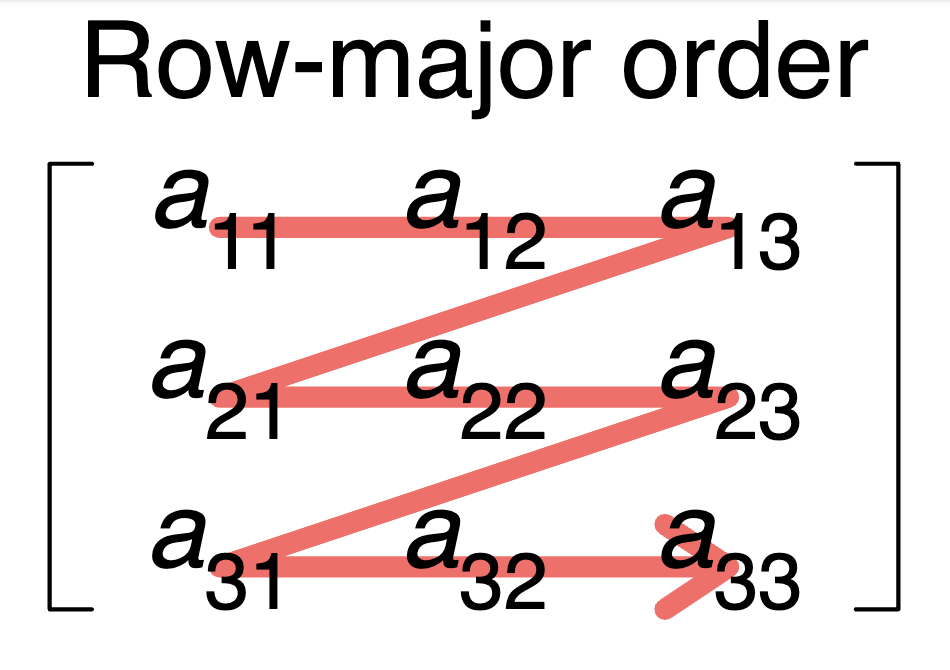

# Exercise 3: Collections and Iteration

In this exercise, you'll learn how Rust handles collections and loops. You'll stitch two images together horizontally—a task that requires creating a pixel buffer, iterating over image data, and copying pixels into precise positions.

<div class="workshop-objectives">

### What you'll learn

- **Vectors**: Rust's growable array type, `Vec<T>`
- **Slices**: Borrowed views into contiguous data, `&[T]` and `&mut [T]`
- **`for` loops**: Iterating over collections

</div>

## The Goal

We want to take two images and combine them side-by-side into a single, wider image. The left image stays on the left, the right image goes next to it, and any height difference gets filled with white pixels.

This might sound simple, but it requires us to work with raw pixel data—creating a buffer, calculating positions, and copying bytes. Rust gives you the low-level control to do this efficiently.

Let's look at the function signature in `exercises/src/exercise_3.rs`:

```rust
pub fn transform(left: &PhotonImage, right: &PhotonImage) -> PhotonImage {
    // ...
}
```

Unlike previous exercises, this function takes references of **two** images and returns a brand new one. We'll need to create a fresh pixel buffer, copy data from both source images, and construct the result.

## Vectors: Rust's Growable Arrays

In JavaScript and other garbage collected languages, arrays can grow freely:

```javascript
const arr = [];
arr.push(1);
arr.push(2);
arr.push(3); // we can keep going
```

In JavaScript even mixed types are allowed!

```javascript
const arr = [];
arr.push(1);
arr.push("hello");  // Mixed types are allowed
```

Rust does things differently. Being strongly-typed it requires all elements to have **the same** type. Rust also features _two_ array types
that you can pick depending on your need: _Arrays_ and _Vectors_. Arrays are **fixed-size** collections, they cannot grow dynamically while Vectors are _growable_.

```rust
// this creates an array of fixed size 4.
let mut a = [0, 5, 8, 9];

// we can manipulate the items...
a[0] = 1;
// ...but we cannot add more elements
a.push(12); // this does not exist!!


// this creates an empty vectors
let mut v = Vec::new();

// that we can then push elements to
numbers.push(1);
numbers.push(2);
numbers.push(3);

// we can also still manipulate them of course!
a[0] = 1;
```

Vectors are of course much convenient and closer to collections you might be familiar with from other languages. This convenience come at a
cost though, as Vectors impose much more overhead since they need to actively manage the underlying memory. The compiler can also much better optimize
fixed-sized arrays.

Which array type to choose therefore comes down to your requirements: _How fast does it need to be? Is the size known ahead-of-time or only known at runtime?_

Before you read on, what array type would you use for this our exercise?

### The `vec!` macro

Creating a vector by manually pushing items to it is really cumbersome, which is why Rust provides a handy _macro_ (you can tell by the exclamation mark `!` which designates macro calls) for creating vectors that feels as nice as the static array initialization:

```rust
// this snippet
let mut v = Vec::new();
v.push(1);
v.push(2);
v.push(3);

// is equivalent to this
let v = vec![1, 2, 3];
```

The macro can also create a vector filled with a repeated value for initializing large arrays:

```rust
// Create 100 bytes, all set to 255
let pixels = vec![255u8; 100];
```

This syntax—`vec![value; count]`—creates `count` copies of `value`. The `u8` suffix tells Rust we want unsigned 8-bit integers (bytes), which is exactly what we need for pixel data.

<!--## Slices: Borrowed Views into Data

A **slice** is a reference to a contiguous sequence of elements. Think of it as a "window" into an array or vector—you can see and potentially modify the data, but you don't own it.

```rust
fn process(data: &[u8]) {
    // `data` is a borrowed view into some bytes
    // We can read from it, but we don't own it
}

fn modify(data: &mut [u8]) {
    // `data` is a mutable borrowed view
    // We can read AND write, but still don't own it
}
```

The type `&[T]` is an immutable slice—read-only access. The type `&mut [T]` is a mutable slice—read and write access.

### Why Our Function Uses `&mut [u8]`-->

In our exercise code, we have the following helper function:

```rust
fn copy_into(dst: &mut [u8], dst_width: u32, src: &PhotonImage, x_offset: u32) {
    // Copy pixels from `src` into the `dst` buffer
}
```

The parameter `dst: &mut [u8]` is a mutable slice of bytes. This is exactly the same as the _string slice_ we encountered in the previous exercise, but it additionally allows us to mutate the data in the slice. We're borrowing the pixel buffer and writing into it. This is important because making a full copy of the image for every call would be prohibitively slow!

## The `for` Loop

Rust's `for` loop is the primary loop type that you will encounter. There are others of course `while` loops and `loop` loops but `for` loops are the most ergonomic.

`for` loops iterate over anything that implements the `Iterator` trait. Introducing traits would blow the scope of this workshop, but suffice it to say _traits_ are essentially _interfaces_. They encapsulate shared behaviour and you can, as the `for` loop does, require arguments to _implement_ certain traits.

You can think of this like a more rigorous version of JavaScripts [`[Symbol.iterator]()`](https://developer.mozilla.org/en-US/docs/Web/JavaScript/Reference/Iteration_protocols#the_iterable_protocol) protocol.

A common pattern that you see with for loops is iterating over a _range_ of numbers:

```rust
for y in 0..height {
    // y takes values: 0, 1, 2, ..., height-1
}
```

The `0..height` syntax creates a `Range`—a sequence from 0 up to (but not including) `height`.\
This is similar, but much less error prone and more convenient, than the `for` loop in JavaScript or C/C++:

```javascript
for (let y = 0; y < height; y++) {
    // ...
}
```

### Nested Loops for 2D Data

Digital images are 2D grids of pixels stored as a flat array of bytes in _Row Major Order_. This means the buffer starts with the first row of pixels, then the second, then the third and so on.



Images are 2D grids, so we often need nested loops:

We can use two nested for loops to iterate over every pixel in the image like so:

```rust
for y in 0..src_height {
    for x in 0..src_width {
        // Process pixel at (x, y)
    }
}
```

Each pixel has four components: Red, Green, Blue, and Alpha (transparency). For an image that's `width × height` pixels, the raw data is `width × height × 4` bytes.

To find a specific pixel's data, we calculate its index:

```rust
let pixel_index = (y * width + x) * 4; // `* 4` to account for the four bytes per pixel.
// pixel_index     -> Red
// pixel_index + 1 -> Green
// pixel_index + 2 -> Blue
// pixel_index + 3 -> Alpha
```

This formula converts 2D coordinates `(x, y)` into a position in the 1D byte array.

### Copying Pixels Between Buffers

Here's how we copy pixels from a source image into a destination buffer at an offset:

```rust
fn copy_into(src_pixels: &mut [u8], dst_width: u32, src: &PhotonImage, x_offset: u32) {
    let src_pixels = src.get_raw_pixels();
    let src_width = src.get_width();
    let src_height = src.get_height();

    for y in 0..src_height {
        for x in 0..src_width {
            // we calculated the index of our pixel in the source image pixel buffer `src_pixels`
            let src_index = ((y * width + x) * 4) as usize;

            // we need to compute the index of our pixel in the destination image 
            // and then copy the pixels 4 bytes into the destination position
        }
    }
}
```

Notice the `as usize` casts. Rust uses `usize` for array indices—a pointer-sized unsigned integer. Our width and height are `u32`, so we cast
the calculated index to `usize` for array access.

## Assertions: Documenting Assumptions

Our transform function starts with assertions:

```rust
assert!(left.get_width() > 0);
assert!(right.get_width() > 0);
```

The `assert!` macro checks a condition and panics if it's false. Unlike exceptions in other languages, a panic in Rust is unrecoverable in the current thread—the program crashes with an error message.

Assertions serve two purposes:

1. **Documentation**: They make your assumptions explicit. Anyone reading the code knows immediately that zero-width images aren't supported.

2. **Fail-fast debugging**: If an assumption is violated, you find out immediately, with a clear error pointing to the exact line.

Use assertions for conditions that _should never happen_ if the code is correct. For conditions that _might_ happen (like invalid user input), we'll learn about proper error handling with `Result` in Exercise 4.

## Your Task

👉 Open `exercises/src/exercise_3.rs` and implement the todos!

Don't forget to run **`./serve.sh`** to open the frontend, start the backend and serve your exercises.

👉 Test the implementation using the buttons below with two different images.

<div class="workshop-exercise">
    <label for="imageUrlLeft">Left input image (URL)</label>
    <input type="text" class="workshop-image-url" id="imageUrlLeft" placeholder="URL of source image" value="https://picsum.photos/1800/1600" />
    <label for="imageUrlRight">Right input image (URL)</label>
    <input type="text" class="workshop-image-url" id="imageUrlRight" placeholder="URL of source image" value="https://picsum.photos/1800/1600" />
    <div class="workshop-buttons">
        <button class="workshop-btn workshop-btn-backend" onclick="triggerBackendExercise3()">
            Backend
        </button>
        <button class="workshop-btn workshop-btn-wasm" onclick="triggerWasmExercise3()">
            Wasm
        </button>
        {{#include includes/spinner.svg}}
    </div>
    <div class="workshop-output">
        <h4>Output <span id="timing-info"></span></h4>
        <div class="workshop-output--noncompare">
            
        </div>
    </div>
</div>

{{#include includes/error-flash.html}}

## What's Next?

You've learned how Rust handles collections with vectors and slices, and how `for` loops provide safe iteration over ranges. You've also seen how Rust gives you low-level control over memory while preventing common bugs.

In the next exercise, we'll take this further with **parallel iteration**. You'll use Rayon to process data across multiple CPU cores, turning sequential loops into concurrent operations with minimal code changes.
